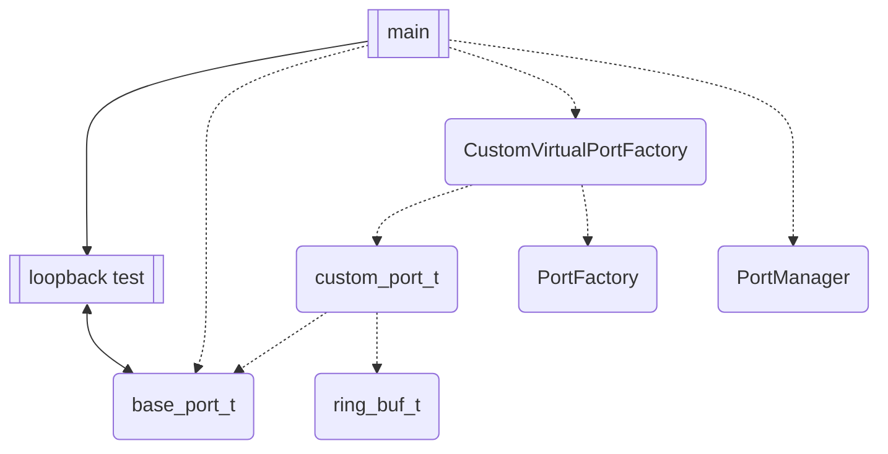
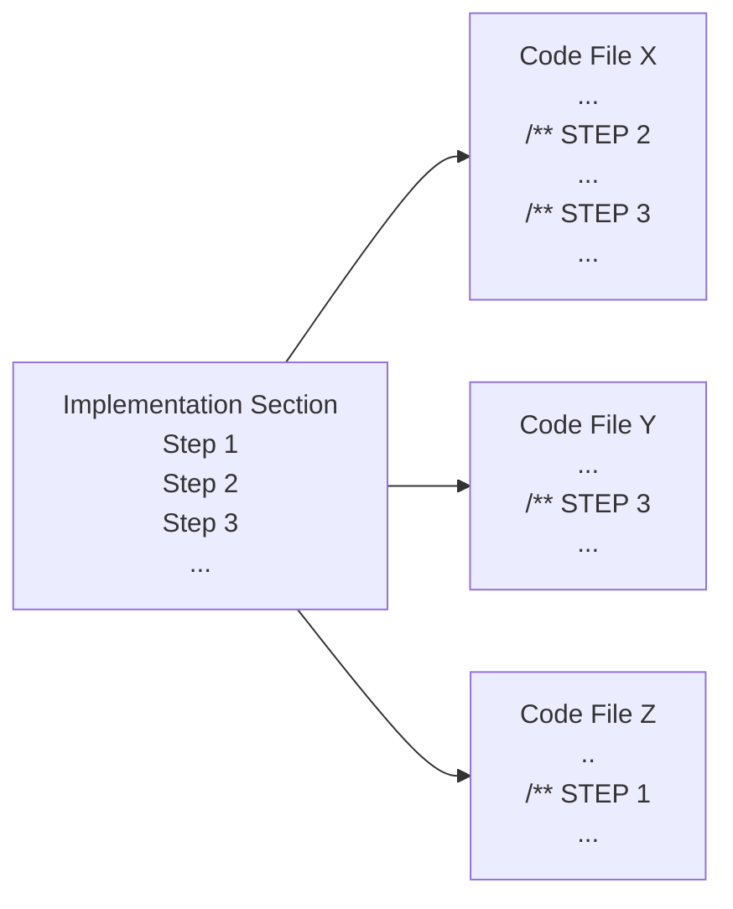

# SDK: Port Factory Custom Virtual Communications Port Example Project

## Introduction
This [CustomVirtualPortExample](https://github.com/inertialsense/inertial-sense-sdk/tree/develop/ExampleProjects/CustomPort/CustomVirtual) project demonstrates the creation of a custom virtual test port as the `base_port_t` implementation, and the creation and usage of a custom `PortFactory` child class, using the Inertial Sense SDK.  It also shows how to use `PortManager` to maintain the set of ports that come out of port factory operations.  A simple application can be built from the provided code out of the box.

## Purpose and Design
This project is constructed as both a walk-through and a template for users wishing to learn how to make use of three modules of the SDK that would be important pieces for communications management.  

One is the `base_port_t` which is a C struct object that provides a data-in and data-out genericized interface to layer on top of the data transportation mechanism underneath that the user creates, custom to their application.  It “knows the essential things” about a port.  It provides a framework for maintaining port status and performing port operations.  Many port implementations can be used and the header file provides port definitions used across the entire product line & SDK.  

The second is the `PortFactory` which is an abstract C++ class that is responsible for discovery of available ports of a particular type.  There should be one implementation for each type of discoverable port.  A name or some other identifier can be used by the port implementation to create the port.  The `PortFactory` constructor does not really create a port, but the class provides binding to a port, and this operation does return a port handle.  Each factory is responsible for identifying & validating possible ports of a particular type.  Also responsible for allocating, configuring, and deallocating a port of that type, by its name.  As an abstract class, this allows for third-party locators to be implemented for custom port types.

Finally, we demonstrate the `PortManager`, which uses the custom port factory to create and keep a known list of available ports based on given search parameters.  It will provide access to a port factory's bound ports as requested.

In this example we use a simple virtual serial test port for our `base_port_t` implementation, which is built upon the SDK's ring buffer.  Loopback and internally bridged test ports are available, but the loopback ports are used by default in this example.  Our custom `PortFactory` then binds to this port and we demonstrate the usage of the required minimum port factory operations.  The application main provides an entry point for the user to identify the port and calls on the port factory to find and bind it through the `PortManager`.  Then, a simple data write/read/compare is performed through the loopback port, demonstrating the `base_port_t` interface.  See this dependency (dashed) and process (solid) diagram for an overview:



## Files

#### Project Files

* [main.cpp](https://github.com/inertialsense/inertial-sense-sdk/tree/release/ExampleProjects/CustomPort/CustomVirtual/CustomVirtualExample.cpp)
* [custom_virtual_port.cpp](https://github.com/inertialsense/inertial-sense-sdk/tree/release/ExampleProjects/CustomPort/CustomVirtual/custom_virtual_port.cpp)
* [custom_virtual_port.h](https://github.com/inertialsense/inertial-sense-sdk/tree/release/ExampleProjects/CustomPort/CustomVirtual/custom_virtual_port.h)
* [CustomVirtualPortFactory.cpp](https://github.com/inertialsense/inertial-sense-sdk/tree/release/ExampleProjects/CustomPort/CustomVirtual/CustomVirtualPortFactory.cpp)
* [CustomVirtualPortFactory.h](https://github.com/inertialsense/inertial-sense-sdk/tree/release/ExampleProjects/CustomPort/CustomVirtual/CustomVirtualPortFactory.h)


Note these are local to this folder.

#### SDK Files

* [com_manager.h](https://github.com/inertialsense/inertial-sense-sdk/tree/main/src/com_manager.h)
* [core/base_port.h](https://github.com/inertialsense/inertial-sense-sdk/tree/main/src/core/base_port.h)
* [core/msg_logger.h](https://github.com/inertialsense/inertial-sense-sdk/tree/main/src/core/msg_logger.h)
* [ISUtilities.h](https://github.com/inertialsense/inertial-sense-sdk/tree/main/src/ISUtilities.h)
* [PortFactory.h](https://github.com/inertialsense/inertial-sense-sdk/tree/main/src/PortFactory.h)
* [PortManager.h](https://github.com/inertialsense/inertial-sense-sdk/tree/main/src/PortManager.h)
* [ring_buffer.h](https://github.com/inertialsense/inertial-sense-sdk/tree/main/src/ring_buffer.h)

Note paths relative to SDK src/ folder.

## Documentation Usage and Project Navigation
In the [Implementation](#implementation) section of this README, you will find a series of sub-sections called Steps, which you may follow in order.  These Steps accomplish two purposes:  one is to provide a guided tour of the project files by reference and sample, and the second is to outline a process for how a user might go about creating their own versions of a custom port and port factory for their purposes.  This is done by explaining what has been created for you already by way of demonstration, and why each piece is critical. Thus, as you proceed through the Step sub-sections you will find that you are not being instructed to generate any new code, as it is a fully functional example already, but rather being introduced to how something similar could be created.

Each Step is part of a project-level process, will reference one or more of the code files, and describe actions the user can take in the custom port or port factory creation.  Each code file in the local project folder will contain one or more commented sections each associated with a README Step section, and the Step sections in a given file may start at any Step number depending on when in the project-level process that file's contents come into play.

Here is a visual representation of the STEP concept to help navigate:


The parts of the code associated with a given README Step are tagged like this:
```C++
/** STEP 6: 
```

Doxygen style comments are ubiquitous throughout the three example Project Files.  You may build the Doxygen HTML documentation by creating a Doxyfile and following standard Doxygen build instructions if that suits you, but all information is contained in this document plus the files listed above.  

```C
/** 
 * @note These double-asterisk comments are Doxygen style, included in documentation 
 * generated by that tool if run, and found throughout the code in this
 * example to guide users through the process of creating and using custom ports
 */
```

The following implementation instructions identify some examples of similar code to that found under corresponding "STEP X" markings in the source files.  Please refer to the source file code directly and **treat the incomplete snippets of code in this README as orientation only**.

## Implementation

### Step 1: Create Port Implementation Header
We must identify and source or build the underlying transport mechanism.  The `PortFactory` is designed to provide a base class for building a port discoverer, upon any lower level port type.  Your port implementation extends the SDK `base_port_t` C object, and `base_port_t` then provides an API for access using a set of function hooks for methods implemented in your code.  The `base_port_t` comes with definitions for all kinds of different port types.  See the SDK [base_port.h](https://github.com/inertialsense/inertial-sense-sdk/tree/main/src/core/base_port.h).

Some of the port types defined in base_port.h:
```C
//...
#define PORT_TYPE__UDP              0x0006      //!< this port wraps a UDP-based network socket
#define PORT_TYPE__FILE             0x0007      //!< this port wraps a OS file handle/stream
#define PORT_TYPE__LOOPBACK         0x00FE      //!< this port is a loopback to another port.
#define PORT_TYPE__COMM             0x1000      //!< this is a modifier for other port types, indicating that the port is a communication port, with a is_comm instance and message/packet parsing capabilities
//...
```

 A minimal viable set of functions will be required for your specific application and you must implement them for your project to provide the mechanism that the port will use.  Some of the `base_port_t` function handles from base_port.h:
```C
typedef struct base_port_s {
    //...
    pfnPortValidate portValidate;           //!< a function which confirms the viability of the port - this does not open or connect the port
    pfnPortOpen portOpen;                   //!< a function to open/connect the specified port - may not be supported by all implementations
    pfnPortClose portClose;                 //!< a function to close/disconnect the specified port - may not be supported by all implementations
    pfnPortFree portFree;                   //!< a function which returns the number of bytes which can safely be written
    pfnPortAvailable portAvailable;         //!< a function which returns the number of bytes currently available, waiting to be read
    pfnPortFlush portFlush;                 //!< a function to flush all data currently waiting to be read
    pfnPortDrain portDrain;                 //!< a function to clear/drain all data currently waiting to be written/sent to the port
    pfnPortRead portRead;                   //!< a function to return copy some number of bytes available for reading into a local buffer (and removed from the ports read buffer)
    //...
} base_port_t;
```

In our example, we will create a custom virtual port `custom_port_t` built upon the SDK ring buffer construct.  Add required includes to new header file, which in this case is [custom_virtual_port.h](https://github.com/inertialsense/inertial-sense-sdk/tree/release/ExampleProjects/CustomPort/CustomVirtual/custom_virtual_port.h):
```C
#include "core/base_port.h"
#include "ring_buffer.h"  //optional, depends upon your implementation
#include "com_manager.h" //optional, depends upon your implementation
```

### Step 2: Extend base_port_t With New Structure
In this example we create a virtual port defined in [CustomVirtualPort.h](https://github.com/inertialsense/inertial-sense-sdk/tree/release/ExampleProjects/CustomPort/CustomVirtual/CustomVirtualPort.h), which has both loopback and internally bridged passthrough ports, so that the example can be demonstrated without specialized hardware:

```C
typedef struct custom_port_s {
    union {
        base_port_t base;
        comm_port_t comm;
    };

    // Used to simulate serial ports
    ring_buf_t      portRingBuf;
    uint8_t         portBuffer[PORT_BUFFER_SIZE];
    uint8_t         name[6];
} custom_port_t;

```

Add forward declarations for the implementation, such as the examples below:
```C
static int customPortRead(port_handle_t port, unsigned char* buf, unsigned int len);
static int customPortWrite(port_handle_t port, const unsigned char* buf, unsigned int len);
//etc
```

As this is a virtual port that does not rely on any hardware or third-party drivers, we can create more than one that share laregly the same characteristics, and/or customize some for a specific purpose.  In [CustomVirtualPort.cpp](https://github.com/inertialsense/inertial-sense-sdk/tree/release/ExampleProjects/CustomPort/CustomVirtual/CustomVirtualPort.cpp):

```C
custom_port_t g_customPorts[NUM_COM_PORTS] = {};
```

In this project we have created and initialized six virtual ports.  Two are loopback ports, and four are bridged together with one other port in two distinct pairs.  Only the two loopback ports are demonstrated in our application, but a user could easily modify it to include all these virtual ports.


### Step 3: Complete Port Implementation
In [CustomVirtualPort.cpp](https://github.com/inertialsense/inertial-sense-sdk/tree/release/ExampleProjects/CustomPort/CustomVirtual/CustomVirtualPort.cpp) we define various port functions that leverage the underlying transport mechanism of the port, which in this case is the SDK ring buffer, as seen here:

```C
static int customPortRead(port_handle_t port, unsigned char* buf, unsigned int len)
{
    return ringBufRead(&((custom_port_t*)port)->portRingBuf, buf, len);
}

static int customPortWrite(port_handle_t port, const unsigned char* buf, unsigned int len)
{
    custom_port_t* destPort = boundPorts[portId(port)];

    if (ringBufWrite(&destPort->portRingBuf, (unsigned char*)buf, len))
    {   
   //...
}
//etc
```

These will provide the underlying functionality for the `base_port_t` extension once properly assigned to the base port's API.  It may be useful to compare CustomVirtualPort.h and base_port.h to see how the base port is extended.


Our CustomVirtualPort.cpp provides an initialization function that links the handles of our virtual port implementation to the `base_port_t`, allowing us to use the generic `base_port_t` API regardless of the details of the underlying implementation.  These and many settings are shared for all our virtual ports, being the same nature as ports.  Other settings like type can be specified for different ports.  We will reference these virtual ports with the simple string names "TEST\<X\>", as in `TEST0`.

```C++
void initCustomPorts() {
   int portNum = 0;
   for (custom_port_t& port : g_customPorts) {
      port.base.pnum = portNum;
      port.base.ptype = PORT_TYPE__COMM;
      if (portNum <= 1)
         port.base.ptype |= PORT_TYPE__LOOPBACK;  // only PORT0 and PORT1 are Loopbacks

         port.base.portRead = customPortRead;
         port.base.portWrite = customPortWrite;
         //etc

         SNPRINTF((char *)port.name, PORT_NAME_SIZE, "TEST%1d", portNum);
            
         portNum++;
    }
}
```

When we create our new custom port factory in the following steps, we can call this init function to complete set up of the virtual ports and `base_port_t` interface and allow you to bind to the port so you can send data.


### Step 4: Extend PortFactory with New Class
This example creates the `CustomVirtualPortFactory` derived class specified by the files CustomVirtualPortFactory.h and CustomVirtualPortFactory.cpp.  With these files we will derive a new port factory from the SDK `PortFactory` class.

Example headers for .h file:
```C++
#include "core/base_port.h"
#include "PortFactory.h"
#include "CustomVirtualPort.h"
```

See the CustomVirtualPortFactory.h file for configuration example of the singleton port factory, required and optional class members and functions, etc.  The header file defines a child class that inherits from `PortFactory`, as in:
```C++
class CustomVirtualPortFactory : public PortFactory
```

With many projects using real port devices and relying on their driver initialization, your custom port factory constructor can be empty.  In our case, we have to build and init our own virtual ports, so let's do the necessary init of the `base_port_t` and its implementation in our custom port factory constructor.  We use our init support function we created for our port implementation in CustomVirtualPort.cpp:

```C++
CustomVirtualPortFactory() {
   /** This init routine assigns the base port functions of the underlying port implementation, for all virtual ports
   */
   initCustomPorts();
}
```

The .cpp file body will define at a minimum the following virtual `PortFactory` functions, which we demonstrate in this example with these forward declarations:
```C++
port_handle_t CustomVirtualPortFactory::bindPort(const std::string& pName, uint16_t pType);
bool CustomVirtualPortFactory::releasePort(port_handle_t port);
bool CustomVirtualPortFactory::validatePort(const std::string& pName, uint16_t pType);
void CustomVirtualPortFactory::locatePorts(std::function<void(PortFactory*, uint16_t, std::string)> portCallback, const std::string& pattern, uint16_t pType)
```


### Step 5: Complete Custom Port Factory Implementation

Example headers for .cpp file:
```C++
#include <vector>
#include <regex>
#include "CustomVirtualPortFactory.h"
#include "ISUtilities.h"
#include "core/msg_logger.h"
```

We next complete the four required minimum functions for a port factory implementation.  Because we are using `PortManager`, we can do all the `PortFactory` work through it rather than directly, so we don't actually need to write any code in our application to access these four required custom port factory functions.  We only implement them.  The application code will interact with the `PortManager` and `base_port_t` interfaces only.

`validatePort()` will check the name and type of the port, called at the beginning of the bind process.  In `bindPort()`, after completing port validation, you'll need to return a `port_handle_t` (that points to a `base_port_t`) to the caller after identifying or allocating your port.  In this example, we use the globally defined `CustomVirtualPort` array of test ports accessed via macro, with the names of the ports being `TEST0`, `TEST1`, etc.

```C++
custom_port_t* customPort;
if (pName == "TEST0") {
   customPort = TEST0_PORT;
}
else if (pName == "TEST1") {
   customPort = TEST1_PORT;
}
else
   return nullptr;

/** Need a port_handle_t reference to our port to use for our own validation and to return from bind */
port_handle_t port = (port_handle_t) customPort;
```

The purpose of `locatePorts()` is to walk through available ports to find any that match a given search pattern parameter, and then make a callback jump to the `PortManager` handler function for each one found, which enables the manager to discover ports. The first portion of this function will be your custom code for identifying the names of the available virtual ports you've created.  The second portion will be the validation and then callback jump, such as shown here:

```C++
for (auto& name : portNames) {
   auto match = std::regex_match(name, matchPattern);
   if (validatePort(name, (PORT_TYPE__LOOPBACK | PORT_TYPE__COMM) ) && match) {            
      portCallback(this, (PORT_TYPE__LOOPBACK | PORT_TYPE__COMM), name);
   }
}
```

Finally, `releasePort()` will do any cleanup or freeing of memory for the ports you created, as needed, since the port is no longer to be used.  This is called by the `PortManager` destructor by default.

Add in additional support functions to the CustomVirtualPortFactory.cpp file as needed for your specific application.  


### Step 6: Create Example Application
Create a new .cpp file for the application, which for us is main.cpp in this example.

Include headers for any desired Inertial Sense SDK utilities, user IO capabilities, etc.  Reference your new `PortFactory` class, and don't forget the `PortManager`:
```C++
#include <stdio.h>
#include "ISUtilities.h"
#include "CustomVirtualPortFactory.h"
#include "PortManager.h"
```

Add forward declarations for any custom application functions if needed (we are not using any in this example), and then create `main()`.  This will be the entry point for your application.  

In summary, our `main()` uses the command line arg for identifying a virtual serial port in a "minimal" example of setting up a custom serial port connection.  Uses `PortManager` and `PortFactory` to bind a `port_handle_t` to the named `base_port_t` port. With the handle, the port is opened, which is in loopback mode in this case, and a simple write/read test is performed.


### Step 7: Create the Port Manager and New Custom Port Factory
In `main()`, we start by first doing a nominal check on the command line argument with some usage statement upon invoke error.  Then we create our communications management by instantiating one `PortManager` and one `CustomVirtualPortFactory` and registering the factory with the manager, like so:
```C++
PortManager& pm = PortManager::getInstance();
CustomVirtualPortFactory& vpf =  CustomVirtualPortFactory::getInstance();
pm.addPortFactory(&vpf);
```

Port init happens in the `CustomVirtualPortFactory` constructor.  Then we are interested in finding all ports matching a certain name pattern and type, but then we'll reference the one specifically indicated on the command line, which is virtual loopback in this case.  Then we need to request our port.
```C++    
pm.discoverPorts(R"(TEST\d\0?)", PORT_TYPE__COMM | PORT_TYPE__LOOPBACK);
port_handle_t port = pm.getPort(argv[1], PORT_TYPE__COMM | PORT_TYPE__LOOPBACK);    
```

 We are identifying the port type (from base_port.h definitions) which is virtual loopback comms in this case.  The `bindPort()` implementation should also validate the port, per the validation method you specify in the CustomVirtualPortFactory.cpp `validatePort()` definition.  Though we had to implement those functions, processing is all handled through the `PortManager`.  Now that we have a port returned from `PortManager`'s `getPort()`, we can start to communicate through it.


### Step 8: Exercise the Loopback Port
In a loop executed a fixed number of iterations, send to and receive a hard coded message on the loopback port.  Use the API of the SDK base_port.h C object, with hooked functions (such as `portWrite()`) implemented by the underlying wrapped virtual test port.

```C++
while (portIsOpened(port) && run_cnt > 0) {
//...
	if (portFree(port) >= wlen) {
		wbytes = portWrite(port, wbuf, wlen);
//...   
	if (portAvailable(port) > 0) {
		rbytes = portRead(port, rbuf, PORT_BUFFER_SIZE);
//...			
```   

For feedback to the user running these data transfers, the logging function described in the next step can log the actions of the `CustomVirtualPortFactory` functions we implemented, the actions of our port implementation functions, and/or the results of our loopback data transfers, etc.


### Step 9: Incorporate Logging
The [msg_logger.h](https://github.com/inertialsense/inertial-sense-sdk/tree/main/src/core/msg_logger.h) API provides multi-platform message logging with level control, and printf-style format strings support.  Add log commands to your application code as desired, like so:

```C++
log_msg(IS_LOG_PORT, IS_LOG_LEVEL_INFO, "Loopback test good on comm port '%s', %d bytes sent/recvd", portName(port), rbytes);
   ```

Facility definitions like `IS_LOG_PORT` or `IS_LOG_PORT_FACTORY` identify which module is logging.


## Compile & Run (Linux)

1. Install necessary dependencies
   ``` bash
   # For Debian/Ubuntu linux, install libusb-1.0-0-dev from packages
   sudo apt update && sudo apt install libusb-1.0-0-dev   
   ```
2. Create build directory
   ``` bash
   cd inertial-sense-sdk/ExampleProjects/CustomPort/CustomVirtual
   mkdir build
   ```
3. Run cmake from within build directory
   ``` bash
   cd build
   cmake ..
   ```
4. Compile using make
   ``` bash
   make
   ```
5. Run executable, with one argument identifying which virtual port to use
   ``` bash
   ./CustomVirtual TEST0
   ```
   *Note that only TEST0 and TEST1 are available by default in this example code, and TEST2 through TEST5 would require modifications to the code to support*

6. View logged results in the file called `inertial_sense.log` that is written local to the app executable.  You should see something like this:
   ```
   [22:08:12.002905] INFO   (IS_LOG_PORT_FACTORY) :: Locating ports with regex pattern 'TEST\d\0?'
   [22:08:12.002998] INFO   (IS_LOG_PORT_FACTORY) :: Found port 'TEST0'
   [22:08:12.003031] INFO   (IS_LOG_PORT_FACTORY) :: Found port 'TEST1'
   [22:08:12.003038] INFO   (IS_LOG_PORT_FACTORY) :: Found port 'TEST2'
   [22:08:12.003044] INFO   (IS_LOG_PORT_FACTORY) :: Found port 'TEST3'
   [22:08:12.003050] INFO   (IS_LOG_PORT_FACTORY) :: Found port 'TEST4'
   [22:08:12.003056] INFO   (IS_LOG_PORT_FACTORY) :: Found port 'TEST5'
   [22:08:12.003470] INFO   (IS_LOG_PORT_FACTORY) :: Bound new comm port 'TEST0'
   [22:08:12.003853] INFO   (IS_LOG_PORT_FACTORY) :: Bound new comm port 'TEST1'
   [22:08:12.005206] INFO   (IS_LOG_PORT) :: Attempting to send msg 'IMPORTANT MESSAGE'
   [22:08:13.005375] INFO   (IS_LOG_PORT) :: Loopback test good on comm port 'TEST0', 17 bytes sent/recvd
   [22:08:13.005418] INFO   (IS_LOG_PORT) :: Attempting to send msg 'IMPORTANT MESSAGE'
   [22:08:14.005627] INFO   (IS_LOG_PORT) :: Loopback test good on comm port 'TEST0', 17 bytes sent/recvd
   [22:08:14.005754] INFO   (IS_LOG_PORT_FACTORY) :: Releasing comm port 'TEST0'
   [22:08:14.005784] INFO   (IS_LOG_PORT_FACTORY) :: Releasing comm port 'TEST1'

   ```

## Compile & Run (Windows MS Visual Studio) - Not Yet Implemented
<strike>
1. Open Visual Studio solution file (inertial-sense-sdk\ExampleProjects\CustomPort\CustomVirtual\VS_project\CustomVirtual.sln)
2. Build (F7)
3. Run executable
   ``` bash
   C:\inertial-sense-sdk\ExampleProjects\CustomPort\CustomVirtual\VS_project\Release\CustomVirtual.exe TEST0
   ```
</strike>

## Summary

If this doesn't cover everything you need, feel free to reach out to us on the <a href="https://github.com/inertialsense/inertial-sense-sdk">inertial-sense-sdk</a> GitHub repository, and we will be happy to help.
