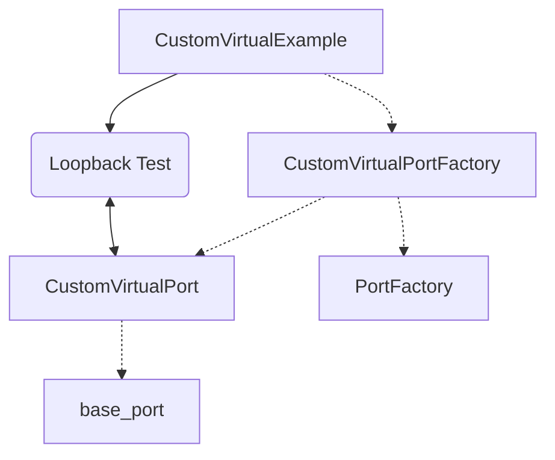
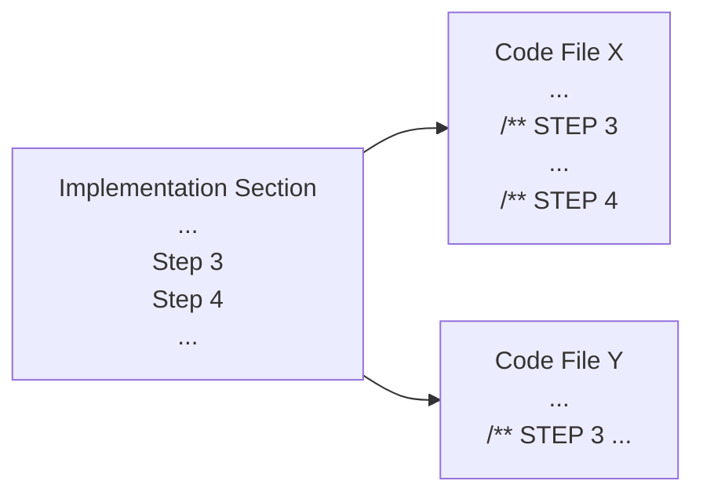

# SDK: Port Factory Custom Virtual Communications Port Example Project

This [CustomVirtualPortExample](https://github.com/inertialsense/inertial-sense-sdk/tree/release/ExampleProjects/CustomPort/CustomVirtual) project demonstrates the creation of a custom virtual test port as the `base_port` channel implementation, and the creation and usage of a custom `PortFactory` child class, using the Inertial Sense SDK.  A simple application can be built from the provided code out of the box.

## Files

#### Project Files

* [CustomVirtualExample.cpp](https://github.com/inertialsense/inertial-sense-sdk/tree/release/ExampleProjects/CustomPort/CustomVirtual/CustomVirtualExample.cpp)
* [CustomVirtualPort.cpp](https://github.com/inertialsense/inertial-sense-sdk/tree/release/ExampleProjects/CustomPort/CustomVirtual/CustomVirtualPort.cpp)
* [CustomVirtualPort.h](https://github.com/inertialsense/inertial-sense-sdk/tree/release/ExampleProjects/CustomPort/CustomVirtual/CustomVirtualPort.h)
* [CustomVirtualPortFactory.cpp](https://github.com/inertialsense/inertial-sense-sdk/tree/release/ExampleProjects/CustomPort/CustomVirtual/CustomVirtualPortFactory.cpp)
* [CustomVirtualPortFactory.h](https://github.com/inertialsense/inertial-sense-sdk/tree/release/ExampleProjects/CustomPort/CustomVirtual/CustomVirtualPortFactory.h)


Note these are local to this folder.

#### SDK Files

* [com_manager.h](https://github.com/inertialsense/inertial-sense-sdk/tree/main/src/com_manager.h)
* [core/base_port.h](https://github.com/inertialsense/inertial-sense-sdk/tree/main/src/core/base_port.h)
* [core/msg_logger.h](https://github.com/inertialsense/inertial-sense-sdk/tree/main/src/core/msg_logger.h)
* [ISUtilities.h](https://github.com/inertialsense/inertial-sense-sdk/tree/main/src/ISUtilities.h)
* [PortFactory.h](https://github.com/inertialsense/inertial-sense-sdk/tree/main/src/PortFactory.h)
* [ring_buffer.h](https://github.com/inertialsense/inertial-sense-sdk/tree/main/src/ring_buffer.h)

Note paths relative to SDK src/ folder.

## Purpose and Design
This project is constructed as both a walk-through and a template for users wishing to learn how to make use of two modules of the SDK that would be important pieces for communications management.  

One is the `base_port` which is a C struct object that provides a data-in and data-out genericized interface to layer on top of the data transportation channel underneath that the user creates, custom to their application.  It “knows the essential things” about a port.  It provides a framework for maintaining port status and performing port operations.  Many channel implementations can be used and the header file provides port definitions used across the entire product line & SDK.  

The other is the `PortFactory` which is an abstract C++ class that is responsible for discovery of available ports of a particular type.  There should be one implementation for each type of discoverable port.  This does NOT return a port, only a name or some other identifier that can be used by the port implementation to create the port.  Each factory is responsible for identifying & validating possible ports of a particular type.  Also responsible for allocating, configuring, and deallocating a port of that type, by its name.  As an abstract class, this allows for third-party locators to be implemented for custom port types.

In this example we use a simple virtual serial test port for our `base_port` implementation, which is built upon the SDK's ring buffer.  Loopback and internally bridged test ports are available, but the loopback ports are used by default in this example.  Our custom `PortFactory` then binds to this port and we demonstrate the usage of the required minimum port factory operations.  The application main provides an entry point for the user to identify the port and calls on the port factory to find and bind it.  Then, a simple data write/read/compare is performed through the loopback port, demonstrating the `base_port` interface.  See this dependency diagram for an overview:



In the Implementation section of this README, you will find a series of sub-sections called Steps, which you may follow in order.  These Steps accomplish two purposes:  one is to provide a guided tour of the project files by reference and sample, and the second is to outline a process for how a user might go about creating their own versions of a custom port and port factory for their purposes.  This is done by explaining what has been created for you already by way of demonstration, and why each piece is critical. Thus, as you proceed through the Step sub-sections you will find that you are not being instructed to generate any new code, as it is a fully functional example already, but rather being introduced to how something similar could be created.

Each Step is part of a project-level process, will reference one or more of the code files, and describe actions the user can take in the custom port or port factory creation.  Each code file in the local project folder will contain one or more commented sections each associated with a README Step section, and the Step sections in a given file may start at any Step number depending on when in the project-level process that file's contents come into play.

The parts of the code associated with a given README Step are tagged like this:
```C++
/** STEP 6: 
```

Here is a visual representation example to help navigate:



## Documentation
Doxygen style comments are ubiquitous throughout the three example Project Files.  You may build the Doxygen HTML documentation by creating a Doxyfile and following standard Doxygen build instructions if that suits you, but all information is contained in this document plus the files listed above.  

```C
/** 
 * @note These double-asterisk comments are Doxygen style, included in documentation 
 * generated by that tool if run, and found throughout the code in this
 * example to guide users through the process of creating and using custom ports
 */
```

The following implementation instructions identify some examples of similar code to that found under corresponding "STEP X" markings in the source files.  Please refer to the source file code directly and **treat the incomplete snippets of code in this README as orientation only**.

## Implementation

### Step 1: Create Port Channel Implementation Header
We must identify and source or build the underlying transport channel.  The `PortFactory` is designed to provide a base class for building a port discoverer, upon any lower level channel type.  Your channel implementation extends the SDK `base_port` C object, and `base_port` then provides an API for channel access using a set of function hooks for methods implemented in your channel code.  The `base_port` comes with definitions for all kinds of different port types.  See the SDK [base_port.h](https://github.com/inertialsense/inertial-sense-sdk/tree/main/src/core/base_port.h).

Some of the port types defined in base_port.h:
```C
//...
#define PORT_TYPE__UDP              0x0006      //!< this port wraps a UDP-based network socket
#define PORT_TYPE__FILE             0x0007      //!< this port wraps a OS file handle/stream
#define PORT_TYPE__LOOPBACK         0x00FE      //!< this port is a loopback to another port.
#define PORT_TYPE__COMM             0x1000      //!< this is a modifier for other port types, indicating that the port is a communication port, with a is_comm instance and message/packet parsing capabilities
//...
```

 A minimal viable set of functions will be required for your specific application and you must implement them for your project to provide the channel that the port will use.  Some of the `base_port` function handles from base_port.h:
```C
typedef struct base_port_s {
    //...
    pfnPortValidate portValidate;           //!< a function which confirms the viability of the port - this does not open or connect the port
    pfnPortOpen portOpen;                   //!< a function to open/connect the specified port - may not be supported by all implementations
    pfnPortClose portClose;                 //!< a function to close/disconnect the specified port - may not be supported by all implementations
    pfnPortFree portFree;                   //!< a function which returns the number of bytes which can safely be written
    pfnPortAvailable portAvailable;         //!< a function which returns the number of bytes currently available, waiting to be read
    pfnPortFlush portFlush;                 //!< a function to flush all data currently waiting to be read
    pfnPortDrain portDrain;                 //!< a function to clear/drain all data currently waiting to be written/sent to the port
    pfnPortRead portRead;                   //!< a function to return copy some number of bytes available for reading into a local buffer (and removed from the ports read buffer)
    //...
} base_port_t;
```

In our example, we will create a `CustomVirtualPort` built upon the SDK ring buffer construct.  Add required includes to your new header file, which in this case is [CustomVirtualPort.h](https://github.com/inertialsense/inertial-sense-sdk/tree/release/ExampleProjects/CustomPort/CustomVirtual/CustomVirtualPort.h):
```C
#include "core/base_port.h"
#include "ring_buffer.h"  //optional, depends upon your implementation
#include "com_manager.h" //optional, depends upon your implementation
```

### Step 2: Extend base_port With New Channel Structure
In this example we create for our channel a virtual test port defined in [CustomVirtualPort.h](https://github.com/inertialsense/inertial-sense-sdk/tree/release/ExampleProjects/CustomPort/CustomVirtual/CustomVirtualPort.h), which has both loopback and internally bridged passthrough ports, so that the example can be demonstrated without specialized hardware:

```C
typedef struct custom_port_s {
    union {
        base_port_t base;
        comm_port_t comm;
    };

    // Used to simulate serial ports
    ring_buf_t      portRingBuf;
    uint8_t         portBuffer[PORT_BUFFER_SIZE];
    uint8_t         name[6];
} custom_port_t;

```

Add forward declarations for the channel implementation:
```C
static int customPortRead(port_handle_t port, unsigned char* buf, unsigned int len);
static int customPortWrite(port_handle_t port, const unsigned char* buf, unsigned int len);
static int customPortFree(port_handle_t port);
static int customPortAvailable(port_handle_t port);
static const char* customPortName(port_handle_t port);
```

### Step 3: Complete Port Channel Implementation
In [CustomVirtualPort.cpp](https://github.com/inertialsense/inertial-sense-sdk/tree/release/ExampleProjects/CustomPort/CustomVirtual/CustomVirtualPort.cpp) we define various functions for specific channel usage, which will provide the underlying functionality for the `base_port` once properly assigned, such as:

```C
static int customPortFree(port_handle_t port) {
    return ringBufFree(&((test_port_t*)port)->portRingBuf);
}

static int customPortAvailable(port_handle_t port) {
    return ringBufUsed(&((test_port_t*)port)->portRingBuf);
}
```

CustomVirtualPort.cpp also provides an initialization function that links the handles of our virtual port channel implementation to the `base_port`, allowing us to use the generic `base_port` API regardless of the details of the underlying channel implementation.  We will reference these virtual ports with the string names "TEST\<X\>", as in `TEST0`.

```C
void initCustomPorts() {
   //...
   port.base.portRead = customPortRead;
   port.base.portWrite = customPortWrite;
   port.base.portFree = customPortFree;
   port.base.portAvailable = customPortAvailable;
   port.base.portName = customPortName;
   //...
   SNPRINTF((char *)port.name, 6, "TEST%1d", portNum);
   //...
}
```

We will later show where this init function would be called by your new custom port factory to complete set up of the `base_port` interface and allow you to send data.


### Step 4: Create New Port Factory Project Files
Create two new files, named something like YOURNAMEPortFactory.h and YOURNAMEPortFactory.cpp.  This example uses the `CustomVirtualPortFactory` derived class.  With these files we will derive a new port factory from the SDK `PortFactory` class.

Example headers for .h file:
```C++
#include "core/base_port.h"
#include "core/msg_logger.h"
#include "PortFactory.h"
#include "CustomVirtualPort.h"
```

Example headers for .cpp file:
```C++
#include <vector>
#include <regex>
#include "CustomVirtualPortFactory.h"
#include "ISUtilities.h"
```


### Step 5: Extend/Define Port Factory for Custom Port

See the CustomVirtualPortFactory.h file for configuration example of the singleton port factory, required and optional class members and functions, etc.  The header file defines a child class that inherits from `PortFactory`, as in:
```C++
class CustomVirtualPortFactory : public PortFactory
```

The .cpp file body will define at a minimum the following virtual `PortFactory` functions, which we demonstrate in this example:
```C++
port_handle_t CustomVirtualPortFactory::bindPort(const std::string& pName, uint16_t pType);

bool CustomVirtualPortFactory::releasePort(port_handle_t port);

bool CustomVirtualPortFactory::validatePort(const std::string& pName, uint16_t pType);

void CustomVirtualPortFactory::locatePorts(std::function<void(PortFactory*, uint16_t, std::string)> portCallback, const std::string& pattern, uint16_t pType)
```

In `bindPort()`, you'll need to return a `port_handle_t` (that points to a `base_port_t`) to the caller after identifying or allocating your port's channel.  In this example, we use the globally defined `CustomVirtualPort` array of test ports accessed via macro, with the names of the ports being `TEST0`, `TEST1`, etc.

```C++
/** In this example we use a virtual port, so there is no baud rate or blocking to set; our port is defined by
 *  CustomVirtualPort; defined g_customPorts given by TESTn_PORT is an array of custom_port_t, 0 and 1 are loopback ports
 *  and present the only ports utilized in this simple example
 */
custom_port_t* customPort;
if (pName == "TEST0") {
   customPort = TEST0_PORT;
}
else if (pName == "TEST1") {
   customPort = TEST1_PORT;
}
else
   return nullptr;

/** Need a port_handle_t reference to our port to use for our own validation and to return from bind */
port_handle_t port = (port_handle_t) customPort;
```

Now that you have a port handle that points to a `base_port` object, we can set up the `base_port` and its channel implementation for use.  Run intialization and validation routines on the new port.  For example, our support function we created for our implementation in CustomVirtualPort.cpp:

```C++
initTestPorts();
```

Add in additional support functions to the CustomVirtualPortFactory.cpp file as needed for the application.  For example, for our virtual comm port we use this function:
```C++
/**
 * Populates a vector of string identifiers for all available virtual ports from test_serial_utils.
 * For this example, it will be a number of virtual ports defined in the data_sets.h header used by the 
 * test_serial_utils definitions.
 * @param portNames a reference to a vector of strings, which will be populated with names identifiers of available ports
 * @return the number of ports found on the host
 */
int CustomVirtualPortFactory::getComPorts(std::vector<std::string>& portNames)
```


### Step 6: Create Example Application
Create a new file named something like YOURNAMEExample.cpp, as in CustomVirtualExample.cpp in this example.

Include headers for any desired Inertial Sense SDK utilities, user IO capabilities, etc.  Reference your new `PortFactory` class:
```C++
/** The port factory child class the user creates, inheriting from PortFactory.h definition */
#include "CustomVirtualPortFactory.h"
```

Add forward declarations for custom application functions, and then create `main()`.  This will be the entry point for your application demonstrating the usage of `base_port` and `PortFactory`.


### Step 7: Create and Init the New Port Factory
Initialize the port with `bindPort()`, identifying the port type (from base_port.h definitions) which is virtual loopback comms in this case.
```C++
CustomVirtualPortFactory& vpf =  CustomVirtualPortFactory::getInstance();
port_handle_t port = vpf.bindPort(argv[1], PORT_TYPE__COMM | PORT_TYPE__LOOPBACK);
```

The `bindPort()` implementation should also validate the port, per the validation method you specify in the CustomVirtualPortFactory.cpp `validatePort()` definition.  In this example, we just check the port type using the available `base_port` definitions.  (See the implementation of `bool CustomVirtualPortFactory::validatePort(const std::string& pName, uint16_t pType)` for details.)


### Step 8: Exercise the Loopback Port
In a loop executed a fixed number of iterations, send to and receive a hard coded message on the loopback port.  Use the API of the SDK base_port.h C object, with hooked functions (such as `portWrite()`) implemented by the underlying wrapped virtual test port.

```C++
while (portIsOpened(port) && run_cnt > 0) {
//...
	if (portFree(port) >= wlen) {
		wbytes = portWrite(port, wbuf, wlen);
//...   
	if (portAvailable(port) > 0) {
		rbytes = portRead(port, rbuf, PORT_BUFFER_SIZE);
//...			
```   

### Step 9: Show Remaining Port Factory Functionality
Show use of `locatePorts()` and `releasePort()` to complete the demonstration of `PortFactory`.  We provide a callback function to `locatePorts()` which is `portHandler()`, defined in our application code in CustomVirtualExample.cpp.

In this example, we give `locatePorts()` a string literal for a regex matching pattern of `R"(TEST\d\0?)"` to use in port name searching.  We also identify the port type flags for the virtual loopback comm ports we are using.

```C++
auto cb = std::bind(portHandler, std::placeholders::_1, std::placeholders::_2, std::placeholders::_3);
vpf.locatePorts(cb, R"(TEST\d\0?)", PORT_TYPE__COMM | PORT_TYPE__LOOPBACK );
//...

vpf.releasePort(port);

```

The logging function described in the next step can log the names of ports that are identified via this search process, which will be six ports in this example project.


### Step 10: Incorporate Logging
The [msg_logger.h](https://github.com/inertialsense/inertial-sense-sdk/tree/main/src/core/msg_logger.h) API provides multi-platform message logging with level control, and printf-style format strings support.  Add log commands to your application code as desired, like so:

```C++
log_msg(IS_LOG_PORT, IS_LOG_LEVEL_INFO, "Loopback test good on comm port '%s'", portName(port));
   ```

Facility definitions like `IS_LOG_PORT` or `IS_LOG_PORT_FACTORY` identify which module is logging.


## Compile & Run (Linux)

1. Install necessary dependencies
   ``` bash
   # For Debian/Ubuntu linux, install libusb-1.0-0-dev from packages
   sudo apt update && sudo apt install libusb-1.0-0-dev   
   ```
2. Create build directory
   ``` bash
   cd inertial-sense-sdk/ExampleProjects/CustomPort/CustomVirtual
   mkdir build
   ```
3. Run cmake from within build directory
   ``` bash
   cd build
   cmake ..
   ```
4. Compile using make
   ``` bash
   make
   ```
5. Run executable, with one argument identifying which virtual port to use
   ``` bash
   ./CustomVirtual TEST0
   ```
   *Note that only TEST0 and TEST1 are available by default in this example code, and TEST2 through TEST5 would require modifications to the code to support*

6. View logged results in the file called `inertial_sense.log` that is written local to the app executable.  You should see something like this:
   ```
   [09:53:34.817948] INFO   (IS_LOG_PORT_FACTORY) :: Allocated new comm port 'TEST0'
   [09:53:35.818278] INFO   (IS_LOG_PORT) :: Loopback test good on comm port 'TEST0'
   [09:53:36.818512] INFO   (IS_LOG_PORT) :: Loopback test good on comm port 'TEST0'
   [09:53:36.818903] INFO   (IS_LOG_PORT_FACTORY) :: Locating ports with regex pattern 'TEST\d\0?'
   [09:53:36.818918] INFO   (IS_LOG_PORT_FACTORY) :: Found port 'TEST0'
   [09:53:36.818923] INFO   (IS_LOG_PORT_FACTORY) :: Found port 'TEST1'
   [09:53:36.818926] INFO   (IS_LOG_PORT_FACTORY) :: Found port 'TEST2'
   [09:53:36.818929] INFO   (IS_LOG_PORT_FACTORY) :: Found port 'TEST3'
   [09:53:36.818932] INFO   (IS_LOG_PORT_FACTORY) :: Found port 'TEST4'
   [09:53:36.818935] INFO   (IS_LOG_PORT_FACTORY) :: Found port 'TEST5'
   [09:53:36.818957] INFO   (IS_LOG_PORT) :: portHandler call success
   [09:53:36.818964] INFO   (IS_LOG_PORT) :: portHandler call success
   [09:53:36.818970] INFO   (IS_LOG_PORT) :: portHandler call success
   [09:53:36.818978] INFO   (IS_LOG_PORT) :: portHandler call success
   [09:53:36.818988] INFO   (IS_LOG_PORT) :: portHandler call success
   [09:53:36.819004] INFO   (IS_LOG_PORT) :: portHandler call success
   [09:53:36.819015] INFO   (IS_LOG_PORT_FACTORY) :: Releasing comm port 'TEST0'
   ```

## Compile & Run (Windows MS Visual Studio) - Not Yet Implemented
<strike>
1. Open Visual Studio solution file (inertial-sense-sdk\ExampleProjects\CustomPort\CustomVirtual\VS_project\CustomVirtual.sln)
2. Build (F7)
3. Run executable
   ``` bash
   C:\inertial-sense-sdk\ExampleProjects\CustomPort\CustomVirtual\VS_project\Release\CustomVirtual.exe TEST0
   ```
</strike>

## Summary

If this doesn't cover everything you need, feel free to reach out to us on the <a href="https://github.com/inertialsense/inertial-sense-sdk">inertial-sense-sdk</a> GitHub repository, and we will be happy to help.
