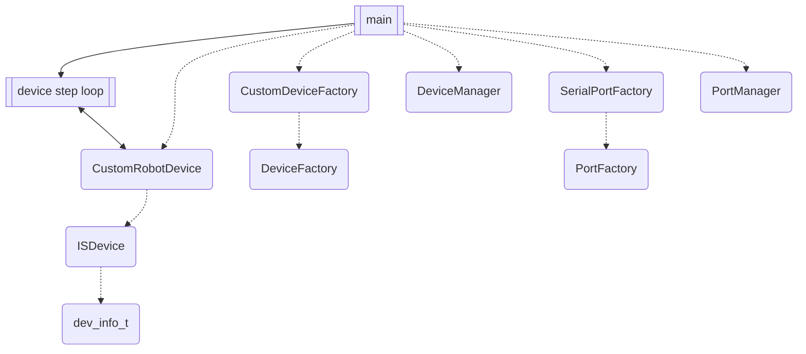
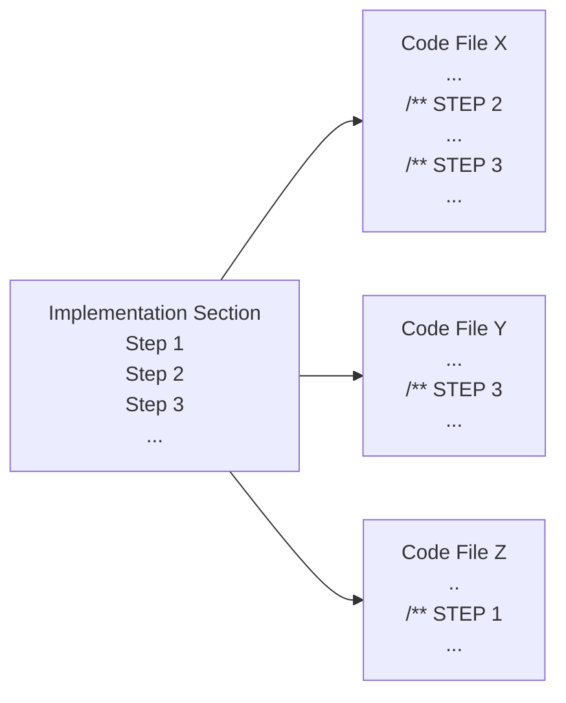

# SDK: Custom Robot Device Example Project

## Introduction
This [Custom Robot Device Example](https://github.com/inertialsense/inertial-sense-sdk/tree/release/ExampleProjects/CustomRobotDevice) project demonstrates the creation of custom `ISDevice` and custom `DeviceFactory` child classes, using the Inertial Sense SDK.  It also shows how to use `PortManager` and `DeviceManager` to maintain the set of discovered ports and discovered devices that come out of factory operations.  A simple application can be built from the provided code out of the box.  **This example requires an IMX device to be connected to your workstation.**

## Purpose and Design
This project is constructed as both a walk-through and a template for users wishing to learn how to make use of three modules of the SDK that would be important pieces for device management.  

One is the `ISDevice` which is a C++ class that represents a single, physical Inertial Sense device (IMX or GPX) bound to a port.  It owns its identity (dev_info_t), synchronized flash/system-parameter state, and the comm-protocol handlers that parse data received from it. DeviceManager owns a collection of these; a caller that only ever talks to one device can use a standalone ISDevice directly without DeviceManager.

The second is the `DeviceFactory` which is an abstract C++ class that is responsible for discovery of connected devices of a particular type.  There should be one implementation for each type of discoverable device.  It handles device-type identification and allocation: given a raw port, determines what kind of Inertial Sense device (if any) is attached and constructs the matching `ISDevice` subclass.  The factory allocates a device object, and this operation returns a `device_handle_t`.  As an abstract class, this allows for third-party locators to be implemented for custom device types.

Finally, we demonstrate the `DeviceManager`, which uses the custom device factory to create and keep a known list of available devices, optionally filtered to a limited set, or all.  It will provide access to a factory's devices as requested.

In this example we use a Linux platform USB serial port for our device connection to an Inertial Sense IMX unit.  Our custom device we are calling `CustomRobotDevice` and it is discovered via our `CustomDeviceFactory`.  We make use of the SDK's provided `SerialPortFactory` extension of `PortFactory` to bind to the port, and `PortManager` as well.  

~~Our custom `PortFactory` then binds to as many of these ports as indicated and we demonstrate the usage of the required minimum port factory operations.  The application main provides an entry point for the user to identify the port and calls on the port factory to find and bind it through the `PortManager`.  Then, a simple data write/read/compare is performed through the loopback port, demonstrating the `base_port_t` interface.  See this dependency (dashed) and process (solid) diagram for an overview:~~



## Documentation Usage and Project Navigation
In the [Implementation](#implementation) section of this README, you will find a series of sub-sections called Steps, which you may follow in order.  These Steps accomplish two purposes:  one is to provide a guided tour of the project files by reference and sample, and the second is to outline a process for how a user might go about creating their own versions of a custom implementation for their purposes.  This is done by explaining what has been created for you already by way of demonstration, and why each piece is critical. Thus, as you proceed through the Step sub-sections you will find that you are not being instructed to generate any new code, as it is a fully functional example already, but rather being introduced to how something similar could be created.

Each Step is part of a project-level process, will reference one or more of the code files, and describe actions the user can take in the custom implementation creation.  Each code file in the local project folder will contain one or more commented sections each associated with a README Step section, and the Step sections in a given file may start at any Step number depending on when in the project-level process that file's contents come into play.

Here is a visual representation of the STEP concept to help navigate:


The parts of the code associated with a given README Step are tagged like this:
```C++
/** STEP 6: 
```

Doxygen style comments are ubiquitous throughout the three example Project Files.  You may build the Doxygen HTML documentation by creating a Doxyfile and following standard Doxygen build instructions if that suits you, but all information is contained in this document plus the files listed above.  

```C
/** 
 * @note These double-asterisk comments are Doxygen style, included in documentation 
 * generated by that tool if run, and found throughout the code in this
 * example to guide users through the process of creating and using custom ports
 */
```

The following implementation instructions identify some examples of similar code to that found under corresponding "STEP X" markings in the source files.  Please refer to the source file code directly and **treat the incomplete snippets of code in this README as orientation only**.

## Files

#### Project Files

* [main.cpp](./main.cpp)
* [CustomDeviceFactory.cpp](./CustomDeviceFactory.cpp)
* [CustomDeviceFactory.h](./CustomDeviceFactory.h)
* [CustomRobotDevice.cpp](./CustomRobotDevice.cpp)
* [CustomRobotDevice.h](./CustomRobotDevice.h)

Note these are local to this folder.

#### SDK Files

* [com_manager.h](../../../src/com_manager.h)
* [core/base_port.h](../../../src/core/base_port.h)
* [core/msg_logger.h](../../../src/core/msg_logger.h)
* [DeviceFactory.h](../../../src/DeviceFactory.h)
* [DeviceManager.h](../../../src/DeviceManager.h)
* [ISDevice.h](../../../src/ISDevice.h)
* [ISUtilities.h](../../../src/ISUtilities.h)
* [PortFactory.h](../../../src/PortFactory.h)
* [PortManager.h](../../../src/PortManager.h)


Note file name list entries relative to SDK `src/` folder, with local relative path linked.

## Implementation

### Step 1: Create Device Implementation Header
The `DeviceFactory` is designed to provide a base class for building a device discoverer, upon any `ISDevice` type, which populates a `dev_info_t`.  Our example device implementation is called `CustomRobotDevice` and extends the `ISDevice` class.  We communicate with the device via the port's `port_handle_t` bound by the `PortFactory`.  We implement data handling methods unique to our device in the code. 

```c++
#include "PortFactory.h"
#include "ISDevice.h"
#include "ISDisplay.h"
```

```c++
class CustomRobotDevice : public ISDevice {
```

```c++
int onIsbDataHandler(p_data_t* data, port_handle_t port) override;
```

An `ISDevice` has a step function

### Step 1: Create Port Implementation Header
We must identify and source or build the underlying transport mechanism.  The `PortFactory` is designed to provide a base class for building a port discoverer, upon any lower level port type.  Our port implementation extends the SDK `base_port_t` C object, and `base_port_t` then provides an API for access using a set of function hooks for methods implemented in the code.  The `base_port_t` comes with definitions for all kinds of different port types.  See the SDK [base_port.h](../../../src/core/base_port.h).

Some of the port types defined in base_port.h:
```C
//...
#define PORT_TYPE__UDP              0x0006      //!< this port wraps a UDP-based network socket
#define PORT_TYPE__FILE             0x0007      //!< this port wraps a OS file handle/stream
#define PORT_TYPE__LOOPBACK         0x00FE      //!< this port is a loopback to another port.
#define PORT_TYPE__COMM             0x1000      //!< this is a modifier for other port types, indicating that the port is a communication port, with a is_comm instance and message/packet parsing capabilities
//...
```

 A minimal viable set of functions will be required for the specific application and we must implement them for the project to provide the mechanism that the port will use.  Some of the `base_port_t` function handles from base_port.h:
```C
typedef struct base_port_s {
    //...
    pfnPortValidate portValidate;           //!< a function which confirms the viability of the port - this does not open or connect the port
    pfnPortOpen portOpen;                   //!< a function to open/connect the specified port - may not be supported by all implementations
    pfnPortClose portClose;                 //!< a function to close/disconnect the specified port - may not be supported by all implementations
    pfnPortFree portFree;                   //!< a function which returns the number of bytes which can safely be written
    pfnPortAvailable portAvailable;         //!< a function which returns the number of bytes currently available, waiting to be read
    pfnPortFlush portFlush;                 //!< a function to flush all data currently waiting to be read
    pfnPortDrain portDrain;                 //!< a function to clear/drain all data currently waiting to be written/sent to the port
    pfnPortRead portRead;                   //!< a function to return copy some number of bytes available for reading into a local buffer (and removed from the ports read buffer)
    //...
} base_port_t;
```

In our example, we will create a custom virtual port `custom_port_t` built upon the SDK ring buffer construct.  We add required includes to the new header file, which in this case is [custom_virtual_port.h](./custom_virtual_port.h):
```C
#include "core/base_port.h"
#include "ring_buffer.h"  //optional, depends upon your implementation
#include "com_manager.h" //optional, depends upon your implementation
```

### Step 2: Extend ISDevice With Custom Device

The `step()` function is called to process any pending, received data on the bound port, and call any registered handlers for any valid packets which are parsed from that data. Additionally, this call will manage other comm-related tasks such as data/config synchronization to the device, as well as progressing firmware updates, etc.  This function should be called a regular interval fast enough to prevent received data from overflowing the port's RX buffer (typically a 1ms interval or faster, for a 921600 Serial Baud rate).  Returns false if the port is invalid or closed, otherwise true. Note that 'true' does NOT provide any indication of data parsed, etc. Only that the port was valid, and that the maintenance functions were called.


### Step 2: Extend base_port_t With New Structure
We create a virtual port defined in [custom_virtual_port.h](./custom_virtual_port.h), so that the example can be demonstrated without specialized hardware:

```C
typedef struct custom_port_s {
   union {
      base_port_t base;
      comm_port_t comm;
   };

   // Used to simulate serial ports
   ring_buf_t      portRingBuf;
   uint8_t         portBuffer[PORT_BUFFER_SIZE];
   uint8_t         name[PORT_NAME_SIZE];  
} custom_port_t;

```

Add forward declarations for the implementation, such as the examples below:
```C
static int customPortRead(port_handle_t port, unsigned char* buf, unsigned int len);
static int customPortWrite(port_handle_t port, const unsigned char* buf, unsigned int len);
//etc
```

As this is a virtual port that does not rely on any hardware or third-party drivers, we can create more than one that share the same characteristics.  Optionally, a user could customize some for a specific purpose.  We will later show where and how these are dynamically allocated in our example.  


### Step 3: Complete Port Implementation

### Step 3: Complete Port Implementation
In [custom_virtual_port.cpp](./custom_virtual_port.cpp) we define various port functions that leverage the underlying transport mechanism, which in this case is the SDK ring buffer, as seen here:

```C
static int customPortRead(port_handle_t port, unsigned char* buf, unsigned int len)
{
   return ringBufRead(&((custom_port_t*)port)->portRingBuf, buf, len);
}

static int customPortWrite(port_handle_t port, const unsigned char* buf, unsigned int len)
{
   custom_port_t* destPort = static_cast<custom_port_t*>(port);  //loopback

   if (ringBufWrite(&destPort->portRingBuf, (unsigned char*)buf, len))
   {   
   //...
}
//etc
```

These will provide the underlying functionality for the `base_port_t` extension once properly assigned to the base port's API.  As you review this example project or complete your own port implementation, it may be useful to compare [custom_virtual_port.h](./custom_virtual_port.h) and [base_port.h](../../../src/core/base_port.h) to see how the base port is defined and extended, and understand the API.  In this example, we have demonstrated only a minimal subset of the available port functions in `base_port_t`, but there are many options beyond simply read and write to enable the usage of a wide variety of underlying transport mechanisms.


In our [custom_virtual_port.cpp](./custom_virtual_port.cpp) we provide an initialization function for the virtual ports that links the handles of our virtual port implementation to the `base_port_t`, allowing us to use the generic `base_port_t` API regardless of the details of the underlying implementation:  
```C++
void initCustomPort(custom_port_t& port, const std::string& pName, const uint16_t pType) {
   //...       
   port.base.portRead = customPortRead;
   port.base.portWrite = customPortWrite;
   //...      
}
```

These and many settings are shared for all our virtual ports, each being the same nature as ports.  Other settings like type can be specified for different ports.  We will reference these virtual ports with the simple string names "TEST\<X\>", as in `TEST0`.  When we create our new custom port factory in the following steps, we can call this init function to complete set up of the virtual ports and `base_port_t` interface and allow us to bind to the port so we can send data.


### Step 4: Extend DeviceFactory with New Class
This example creste the `CustomDeviceFactory` derived class specified by the files [CustomDeviceFactory.h](./CustomDeviceFactory.h) and [CustomDeviceFactory.cpp](./CustomDeviceFactory.cpp).  With these files we will derive a new device factory from the SDK `DeviceFactory` class.

```c++
#include "DeviceFactory.h"
#include "CustomRobotDevice.h"
```

```c++
class CustomDeviceFactory : public DeviceFactory {
   ```

At a minimum, we must implement the allocateDevice function to serve our custom device.
```C++
/**
     * A function to be implemented in the factory responsible for allocating the underlying device type and returning a pointer to it
     * This function should NOT manipulate the underlying port, such as opening, etc.
     * @param devInfo the device information uniquely identifying the specific device
     * @param port an associated port (optional) that this device should be bound to.
     * @return a ISDevice pointer to the newly allocated ISDevice or null of not allocated
     */
    virtual device_handle_t allocateDevice(const dev_info_t &devInfo, port_handle_t port = nullptr) { return std::make_shared<ISDevice>(devInfo, port); };
```

In this example we speak with an IMX-5 unit so we look for that HW idenfication specifically.  If the ident matches, we return a shared pointer to a new `CustomRobotDevice`. 
```C++
device_handle_t allocateDevice(const dev_info_t &devInfo, port_handle_t port) override {

   /** When we find IMX-5 dev info, we know we want to allocate a new custom device */
   if (ENCODE_DEV_INFO_TO_HDW_ID(devInfo) == IS_HARDWARE_IMX_5_0)
      return std::make_shared<CustomRobotDevice>(devInfo, port);

   return nullptr;
}
    ```

### Step 4: Extend PortFactory with New Class
This example creates the `CustomVirtualPortFactory` derived class specified by the files [CustomVirtualPortFactory.h](./CustomVirtualPortFactory.h) and [CustomVirtualPortFactory.cpp](./CustomVirtualPortFactory.cpp).  With these files we will derive a new port factory from the SDK `PortFactory` class.

Example headers for .h file, which will include the new port implementation we've created:
```C++
#include "core/base_port.h"
#include "PortFactory.h"
#include "custom_virtual_port.h"
```

See the [CustomVirtualPortFactory.h](./CustomVirtualPortFactory.h) file for configuration example of the singleton port factory, required class members and functions, etc.  The header file defines a child class that inherits from `PortFactory`, as in:
```C++
class CustomVirtualPortFactory : public PortFactory
```

The .cpp file body will define at a minimum the following virtual `PortFactory` functions, which we demonstrate in this example with these forward declarations:
```C++
port_handle_t CustomVirtualPortFactory::bindPort(const std::string& pName, uint16_t pType);
bool CustomVirtualPortFactory::releasePort(port_handle_t port);
bool CustomVirtualPortFactory::validatePort(const std::string& pName, uint16_t pType);
void CustomVirtualPortFactory::locatePorts(std::function<void(PortFactory*, uint16_t, std::string)> portCallback, const std::string& pattern, uint16_t pType)
```

We add a list of possible port names to this class, which also serves to indicate how many virtual ports we can create and use.  In this example, the default is two.  When running the application, you will specify on the command line which to use in the demonstration.
```C++
const std::array<const char*, 2> portNames = { "TEST0", "TEST1" };
```


### Step 5: Complete Custom Device Factory Implementation
TBD worthwhile to even create a .cpp file for this?

### Step 5: Complete Custom Port Factory Implementation

We put our new factory implementation in [CustomVirtualPortFactory.cpp](./CustomVirtualPortFactory.cpp).  Example headers for this file follow, which should include our new port factory header and any C++ libraries and SDK utilities that are useful for the way we want the port factory to handle our custom port:
```C++
#include <vector>
#include <regex>
#include "CustomVirtualPortFactory.h"
#include "ISUtilities.h"
#include "core/msg_logger.h"
```

We next complete the four required minimum functions for a port factory implementation.  Because we are using `PortManager`, we can do all the `PortFactory` work through it rather than directly, so we don't actually need to write any code in our application to access these four required custom port factory functions.  We only implement them.  The application code will interact with the `PortManager` and `base_port_t` interfaces only.

`validatePort()` will check the name and type of the port, called at the beginning of the bind process.  In `bindPort()`, after completing port validation, we'll need to return a `port_handle_t` (that points to a `base_port_t` and by extension our `custom_port_t`) to the caller after identifying or allocating your port.  In this example, we use dynamic allocation.  We allocate one custom port on each bind operation, with the names of the ports being `TEST0`, `TEST1`, etc, as defined in our `CustomVirtualPortFactory` header.  We then call our port implementation's init function we created in [custom_virtual_port.cpp](./custom_virtual_port.cpp) for the new port.  A sample from our `bindPort()` code showing the handle we return:

```C++
custom_port_t* customPort = new custom_port_t();

if (customPort) {
   /** Set up our new port */
   initCustomPort(*customPort, pName, pType);
}
else
   return nullptr;

/** Need a port_handle_t reference to our port to use for our own validation and to return from bind */
port_handle_t port = (port_handle_t) customPort;
```

The purpose of `locatePorts()` is to walk through available ports to find any that match a given search pattern parameter, and then make a callback jump to the `PortManager` handler function for each one found, which enables the manager to discover ports. Each one is validated using the port types this factory supports, coded into the validation and callback calls.  We are identifying loopback comm ports from base_port.h definitions in this case.  For a different scenario, you might instead use the `locatePorts()` pType argument, which we ignore in our example.

```C++
for (auto& name : portNames) {
   auto match = std::regex_match(name, matchPattern);
   if (validatePort(name, (PORT_TYPE__LOOPBACK | PORT_TYPE__COMM) ) && match) {
      portCallback(this, (PORT_TYPE__LOOPBACK | PORT_TYPE__COMM), name);
   }
}
```

Finally, `releasePort()` will do any cleanup or freeing of memory for the ports we created, as needed, since the port is no longer to be used.  This is called by the `PortManager` destructor by default.  After completing the implementation of these four required functions, add in additional support functions to the [CustomVirtualPortFactory.cpp](./CustomVirtualPortFactory.cpp) file as needed for the specific application.  


### Step 6: Create Example Application
Create a new .cpp file for the application, which for us is [main.cpp](./main.cpp) in this example.  Include headers for any desired Inertial Sense SDK utilities, user IO capabilities, etc.  Reference the new `PortFactory` class, and don't forget the `PortManager`:
```C++
#include <stdio.h>
#include "ISUtilities.h"
#include "CustomVirtualPortFactory.h"
#include "PortManager.h"
```

Add forward declarations for any custom application functions if needed (we are not using any in this example), and then create `main()`.  This will be the entry point for the application.  Our `main()` uses the command line arg for identifying a virtual port in a "minimal" example of setting up a custom serial port connection.  

```C
int main(int argc, char* argv[])
{
    if (argc < 2)
    {
        printf("Please pass the virtual loopback port as the only argument (i.e. TEST0 or TEST1)\r\n");
        return -1;
    }

    printf("Attempting to bind and open virtual port %s\r\n", argv[1]);
```

We will shortly demonstrate how it uses `PortManager` and `PortFactory` to bind a `port_handle_t` to the named `base_port_t` port. With the handle, the port is opened, which is in loopback mode in this case, and a simple write/read test is performed.


### Step 7: Incorporate Logging
The application code in main.cpp uses standard output status messages to inform the user of what is happening at a high level.  However, the SDK provides it's own logging system, and we demonstrate its use in our `ISDevice` extension in CustomRobotDevice.cpp.  The [msg_logger.h](../../src/core/msg_logger.h) API provides multi-platform message logging with level control, and printf-style format strings support.  Log commands can be added like so, from a line in CustomVirtualPortFactory.cpp:

```C++
log_msg(IS_LOG_ISDEVICE, IS_LOG_LEVEL_ERROR, "Failed to send \"Stop Broadcasts\" request." );
   ```

In our main appliaction code we can set the log level to determine which messages will be logged and which ignored:
```C++
IS_SET_LOG_LEVEL(IS_LOG_LEVEL_INFO);
```

Facility definitions like `IS_LOG_DEVICE_MANAGER` or `IS_LOG_PORT_FACTORY` identify which module is logging.


### Step 8: Instantiate the Port Manager and New Custom Port Factory
In `main()`, we started by first doing a nominal check on the command line argument with some usage statement upon invoke error.  Then we create our communications management by instantiating one `PortManager` and one `CustomVirtualPortFactory` and registering the factory with the manager, like so:
```C++
PortManager& pm = PortManager::getInstance();
CustomVirtualPortFactory& vpf =  CustomVirtualPortFactory::getInstance();
pm.addPortFactory(&vpf);
```

We are interested in the Port Manager finding all available ports, then we'll reference the one specifically indicated on the command line and request it.
```C++    
pm.discoverPorts(); 
port_handle_t port = pm.getPort(argv[1]);
```

Port init happens as the Port Manager discovers ports via the `CustomVirtualPortFactory` locate, validate, and bind operations.  Though we had to implement those functions, processing is all handled through the `PortManager` and not directed by our application main.  


### Step 9: Begin Exercise of Base Port Interface

Now that we have a port returned from `PortManager`'s `getPort()`, we can validate, open, and then start to communicate through it.  We run the base port's own validity check and open the port in preparation for testing.

```C++
if ( !portIsValid(port) ) {
//...
if ( !portIsOpened(port) ) {
   //...
```

### Step 10: Run the Loopback Test
In a loop executed a fixed number of iterations, send to and receive a hard coded message on the loopback port.  Use the API of the SDK base port C object, with hooked functions (such as `portWrite()`) implemented by the underlying virtual test port.

```C++
while (portIsOpened(port) && run_cnt > 0) {
//...
	if (portFree(port) >= wlen) {
		wbytes = portWrite(port, wbuf, wlen);
//...   
	if (portAvailable(port) > 0) {
		rbytes = portRead(port, rbuf, PORT_BUFFER_SIZE);
//...			
```   

For feedback to the user running these data transfers, note the logging function described previously can log the actions of the `CustomVirtualPortFactory` functions we implemented.


## Compile & Run (Linux)

1. Install necessary dependencies
   ``` bash
   # For Debian/Ubuntu linux, install libusb-1.0-0-dev from packages
   sudo apt update && sudo apt install libusb-1.0-0-dev   
   ```
2. Create build directory
   ``` bash
   cd inertial-sense-sdk/ExampleProjects/CustomPort/CustomVirtual
   mkdir build
   ```
3. Run cmake from within build directory
   ``` bash
   cd build
   cmake ..
   ```
4. Compile using make
   ``` bash
   make
   ```
5. Run executable, with one argument identifying which virtual port to use
   ``` bash
   ./CustomVirtual TEST0
   ```
   *Note that only TEST0 and TEST1 are available by default in this example code, and adding more ports would require simple modifications to the code to support*

6. View output from the application
   ```
   Attempting to bind and use virtual port TEST0
   Attempting to send msg 'IMPORTANT MESSAGE'
   Loopback test good on comm port 'TEST0', 17 bytes sent/recvd
   Program complete, see inertial_sense.log for more results details
   ```

6. View logged results in the file called `inertial_sense.log` that is written local to the app executable.  You should see something like this:
   ```
   [14:22:27.837833] INFO   (IS_LOG_PORT_FACTORY) :: Locating ports with regex pattern '(.+)'
   [14:22:27.838297] INFO   (IS_LOG_PORT_FACTORY) :: Bind new comm port 'TEST0'
   [14:22:27.838640] INFO   (IS_LOG_PORT_FACTORY) :: Bind new comm port 'TEST1'
   [14:22:28.838805] INFO   (IS_LOG_PORT_FACTORY) :: Release comm port 'TEST0'
   [14:22:28.838846] INFO   (IS_LOG_PORT_FACTORY) :: Release comm port 'TEST1'
   ```

## Support

If this doesn't cover everything you need, feel free to reach out to us via <a href="support@inertialsense.com">email</a>, and we will be happy to help.
