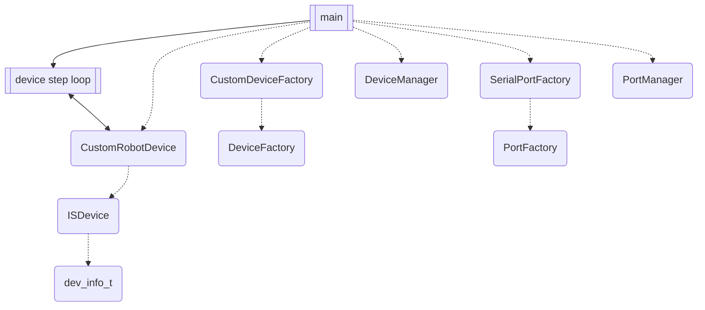
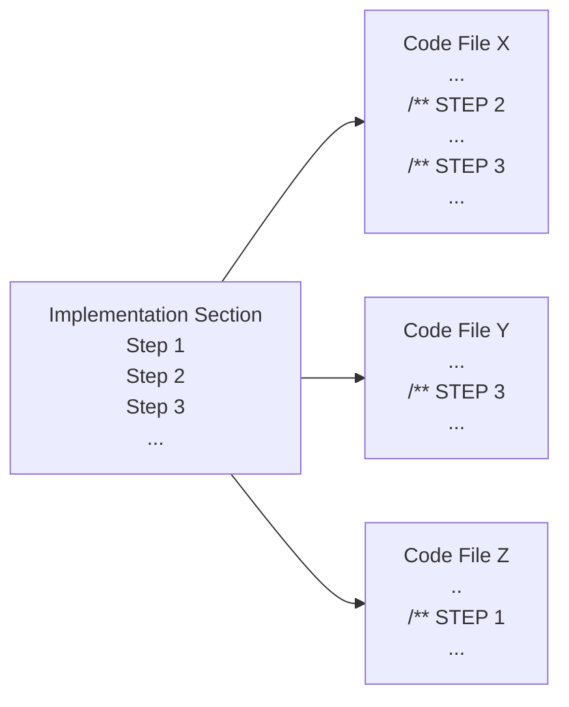

# SDK: Custom Robot Device Example Project

## Introduction
This [Custom Robot Device Example](https://github.com/inertialsense/inertial-sense-sdk/tree/release/ExampleProjects/CustomRobotDevice) project demonstrates the creation of custom `ISDevice` and custom `DeviceFactory` child classes, using the Inertial Sense SDK.  It also shows how to use `PortManager` and `DeviceManager` to maintain the set of discovered ports and discovered devices that come out of factory operations.  A simple application can be built from the provided code out of the box.  **This example requires an IMX device to be connected to your workstation.**

## Purpose and Design
This project is constructed as both a walk-through and a template for users wishing to learn how to make use of three modules of the SDK that would be important pieces for device management.  

One is the `ISDevice` which is a C++ class that represents a single, physical Inertial Sense device (IMX or GPX) bound to a port.  It owns its identity (dev_info_t), synchronized flash/system-parameter state, and the comm-protocol handlers that parse data received from it. DeviceManager owns a collection of these; a caller that only ever talks to one device can use a standalone ISDevice directly without DeviceManager.

The second is the `DeviceFactory` which is an abstract C++ class that is responsible for discovery of connected devices of a particular type.  There should be one implementation for each type of discoverable device.  It handles device-type identification and allocation: given a raw port, determines what kind of Inertial Sense device (if any) is attached and constructs the matching `ISDevice` subclass.  The factory allocates a device object, and this operation returns a `device_handle_t`.  As an abstract class, this allows for third-party locators to be implemented for custom device types.

Finally, we demonstrate the `DeviceManager`, which uses the custom device factory to create and keep a known list of available devices, optionally filtered to a limited set, or all.  It will provide access to a factory's devices as requested.

In this example we use a Linux platform USB serial port for our device connection to an Inertial Sense IMX unit.  Our custom device we are calling `CustomRobotDevice` and it is discovered via our `CustomDeviceFactory`.  We make use of the SDK's provided `SerialPortFactory` extension of `PortFactory` to bind to the port, and `PortManager` as well.  

~~Our custom `PortFactory` then binds to as many of these ports as indicated and we demonstrate the usage of the required minimum port factory operations.  The application main provides an entry point for the user to identify the port and calls on the port factory to find and bind it through the `PortManager`.  Then, a simple data write/read/compare is performed through the loopback port, demonstrating the `base_port_t` interface.  See this dependency (dashed) and process (solid) diagram for an overview:~~



## Documentation Usage and Project Navigation
In the [Implementation](#implementation) section of this README, you will find a series of sub-sections called Steps, which you may follow in order.  These Steps accomplish two purposes:  one is to provide a guided tour of the project files by reference and sample, and the second is to outline a process for how a user might go about creating their own versions of a custom implementation for their purposes.  This is done by explaining what has been created for you already by way of demonstration, and why each piece is critical. Thus, as you proceed through the Step sub-sections you will find that you are not being instructed to generate any new code, as it is a fully functional example already, but rather being introduced to how something similar could be created.

Each Step is part of a project-level process, will reference one or more of the code files, and describe actions the user can take in the custom implementation creation.  Each code file in the local project folder will contain one or more commented sections each associated with a README Step section, and the Step sections in a given file may start at any Step number depending on when in the project-level process that file's contents come into play.

Here is a visual representation of the STEP concept to help navigate:


The parts of the code associated with a given README Step are tagged like this:
```C++
/** STEP 6: 
```

Doxygen style comments are ubiquitous throughout the three example Project Files.  You may build the Doxygen HTML documentation by creating a Doxyfile and following standard Doxygen build instructions if that suits you, but all information is contained in this document plus the files listed above.  

```C
/** 
 * @note These double-asterisk comments are Doxygen style, included in documentation 
 * generated by that tool if run, and found throughout the code in this
 * example to guide users through the process of creating and using custom ports
 */
```

The following implementation instructions identify some examples of similar code to that found under corresponding "STEP X" markings in the source files.  Please refer to the source file code directly and **treat the incomplete snippets of code in this README as orientation only**.

## Files

#### Project Files

* [main.cpp](./main.cpp)
* [CustomDeviceFactory.h](./CustomDeviceFactory.h)
* [CustomRobotDevice.cpp](./CustomRobotDevice.cpp)
* [CustomRobotDevice.h](./CustomRobotDevice.h)

Note these are local to this folder.

#### SDK Files

* [com_manager.h](../../../src/com_manager.h)
* [core/base_port.h](../../../src/core/base_port.h)
* [core/msg_logger.h](../../../src/core/msg_logger.h)
* [DeviceFactory.h](../../../src/DeviceFactory.h)
* [DeviceManager.h](../../../src/DeviceManager.h)
* [ISDevice.h](../../../src/ISDevice.h)
* [ISUtilities.h](../../../src/ISUtilities.h)
* [PortFactory.h](../../../src/PortFactory.h)
* [PortManager.h](../../../src/PortManager.h)


Note file name list entries relative to SDK `src/` folder, with local relative path linked.

## Implementation

### Step 1: Create Custom Device Header
The `DeviceFactory` is designed to provide a base class for building a device discoverer, upon any `ISDevice` type, which populates a `dev_info_t`.  Our example device implementation is called `CustomRobotDevice` and extends the `ISDevice` class.  We communicate with the device via the port's `port_handle_t` bound by the `PortFactory`.  We implement data handling methods unique to our device in the code. 

```c++
#include "PortFactory.h"
#include "ISDevice.h"
#include "ISDisplay.h"
```

Inherit from ISDevice, and add anything custom to make this device unique.  In this example we show a data_set.h type for the DID data we ask for in this application by default, `DID_INS_1`: 
```c++
class CustomRobotDevice : public ISDevice {

public:
   /** structures to hold the data we are interested in for this device. from data_sets.h */
   ins_1_t insData = {};
```

Function declarations for our new class include an optional configuration function to set up our device and pick the data we want to see, a virtual `step()` function implementation, used by every ISDevice to "run" and process messages, and at least one message handler callback.  Implemented in CustomRobotDevice.cpp.
```c++
bool configure();

bool step() override;

int onIsbDataHandler(p_data_t* data, port_handle_t port) override;
```


### Step 2: Extend ISDevice With Custom Device Implementation

We use our custom device class to configure the connected device to send us data and process the data, in CustomRobotDevice.cpp.  After verifying connection and stopping all messages, we identify which messages we would like to receive from the device, starting with `DID_INS_1` type by default.  Any desired DID type can be added one per line:
```c++
bool CustomRobotDevice::configure() {
   //...
   std::vector<std::function<bool()>> bcast_calls = {
      [this]() { return BroadcastBinaryData(DID_INS_1, 25); } //,
      //[this]() { return BroadcastBinaryData(DID_SYS_PARAMS, 100); }  
    };
   //...   
```

The `step()` function is called to process any pending, received data on the bound port, and call any registered handlers for any valid packets which are parsed from that data. Additionally, this call will manage other comm-related tasks such as data/config synchronization to the device, as well as progressing firmware updates, etc.  This function should be called a regular interval fast enough to prevent received data from overflowing the port's RX buffer (typically a 1ms interval or faster, for a 921600 Serial Baud rate).  Returns false if the port is invalid or closed, otherwise true. Note that 'true' does NOT provide any indication of data parsed, etc. Only that the port was valid, and that the maintenance functions were called.  We implement the new `step()` function, but do not add any logic to it for our current purposes.

Finally, we need at least one function to handle the DID messages we receive.  `onIsbDataHandler()` is a callback handler that is registered with the ISDevice once its created, and which will be called every time data arrives from the device.   `p_data_t` struct pointer represents the buffer of data received from the device, including the data ID, associated flags, and the actual data payload.  `port_handle_t` represents the port that this data was received from.  We demonstrate copying the data to an `ins_1_t` object for custom processing one field at a time if desired, as well as using `ISDisplay` to nicely print it to standard out.

```c++
 int CustomRobotDevice::onIsbDataHandler(p_data_t* data, port_handle_t port) {

   if ( ISDevice::onIsbDataHandler(data, port) ) {
      if (data->hdr.id == DID_INS_1) {            
         copyDataPToStructP(&insData, data, sizeof(ins_1_t));
         uint32_t insStatus = insData.insStatus;
         std::cout << isDisplay.DataToString((const p_data_t*)data);
   //...   
 ```

 Note that we first call the ISDevice's own handler as it does a validation on the data.


### Step 3: Extend DeviceFactory with New Class
This example creates the `CustomDeviceFactory` derived class specified by the file [CustomDeviceFactory.h](./CustomDeviceFactory.h).  We will derive it from the SDK `DeviceFactory` class.  The factory acts in concert with the `DeviceManager` to discover a physical device connected via the provided `port_handle_t` and then allocate our device object, giving  us a `device_handle_t`.

```c++
#include "DeviceFactory.h"
#include "CustomRobotDevice.h"
```

```c++
class CustomDeviceFactory : public DeviceFactory {
```

At a minimum, we must implement the allocateDevice function to serve our custom device.
```C++
/**
 * A function to be implemented in the factory responsible for allocating the underlying device type and returning a pointer to it
 * This function should NOT manipulate the underlying port, such as opening, etc.
 * @param devInfo the device information uniquely identifying the specific device
 * @param port an associated port (optional) that this device should be bound to.
 * @return a ISDevice pointer to the newly allocated ISDevice or null of not allocated
 */
virtual device_handle_t allocateDevice(const dev_info_t &devInfo, port_handle_t port = nullptr) { return std::make_shared<ISDevice>(devInfo, port); };
```

In this example we speak with an IMX-5 unit so we look for that HW idenfication specifically.  If the ident matches, we return a shared pointer to a new `CustomRobotDevice`.  We are only implementing this one function that is a few lines long for this new device factory, so we will leave it here in the header rather than create a separate .cpp file. 
```C++
device_handle_t allocateDevice(const dev_info_t &devInfo, port_handle_t port) override {

   /** When we find IMX-5 dev info, we know we want to allocate a new custom device */
   if (ENCODE_DEV_INFO_TO_HDW_ID(devInfo) == IS_HARDWARE_IMX_5_0)
      return std::make_shared<CustomRobotDevice>(devInfo, port);

   return nullptr;
}
```


### Step 6: Create Example Application
Create a new .cpp file for the application, which for us is [main.cpp](./main.cpp) in this example.  Include headers for any desired Inertial Sense SDK utilities, user IO capabilities, etc.  Reference the new `CustomRobotDevice` and `CustomDeviceFactory` classes, and don't forget the `PortManager`:
```C++
#include <stdio.h>
#include "DeviceManager.h"
#include "CustomRobotDevice.h"
#include "CustomDeviceFactory.h"
#include "PortManager.h"
```

We create a `main_discovery()` that operates on our devices and managers, followed by a `main()` entry point that processes the command line.  This will be the entry point for the application.  Our `main()` uses the command line arg for identifying a port (if given) to be used to search for a device.  If no port is given, we search all available ports in a discovery process.  

```C
/**
 * Uses portPattern for discovering a device connected to a port in an example of setting up a custom device
 * connection.  Use PortManager and PortFactory to bind a port_handle_t to the named port. With the handle,
 * the port is opened, and DeviceManager and DeviceFactory search for a device of a certain hardware ID.
 * We then receive data from the found device.
 */
int main_discovery(const char* portPattern)
{
   //...
```

```C
int main(int argc, const char** argv) {

    const char* portPattern = "(.+)";   // NOTE: this is a MATCHING REGEX pattern (this one matches everything)

    if (argc > 2)
    {
        printf("Usage: No argument allows automatic port discovery based on universal pattern.  Or if desired, a single argument selects the port (i.e. /dev/ttyACM0)\r\n");
//...
```


### Step 7: Incorporate Logging
The application code in main.cpp uses standard output status messages to inform the user of what is happening at a high level.  However, the SDK provides it's own logging system, and we demonstrate its use in our `ISDevice` extension in CustomRobotDevice.cpp.  The [msg_logger.h](../../src/core/msg_logger.h) API provides multi-platform message logging with level control, and printf-style format strings support.  Log commands can be added like so, from a line in CustomVirtualPortFactory.cpp:

```C++
log_msg(IS_LOG_ISDEVICE, IS_LOG_LEVEL_ERROR, "Failed to send \"Stop Broadcasts\" request." );
```

In our main appliaction code we can set the log level to determine which messages will be logged and which ignored:
```C++
IS_SET_LOG_LEVEL(IS_LOG_LEVEL_INFO);
```

Facility definitions like `IS_LOG_DEVICE_MANAGER` or `IS_LOG_PORT_FACTORY` identify which module is logging.


### Step 8: Instantiate the Managers and Factories
In `main()`, we started by first doing a nominal check on the command line argument with some usage statement upon invoke error.  Then we create our communications management by instantiating one `PortManager` with a `SerialVirtualPortFactory`, followed by one `DeviceManager` with a `CustomDeviceFactory`, like so:
```C++
PortManager& pm = PortManager::getInstance();
pm.addPortFactory(&SerialPortFactory::getInstance());   // tell the PortManager that we are interested in Serial Ports

DeviceManager& dm = DeviceManager::getInstance();
dm.addDeviceFactory(&CustomDeviceFactory::getInstance());  // tell the DeviceManager that we are interested in Custom Devices
```

We are interested in the Port Manager finding all available ports per the search parameter, then with viable ports we try to find a device that matches our description on the other end:
```C++    
while (retry-- >= 0) {              // some port discovery mechanisms (mDNS, etc) may require multiple calls before ports begin to show
   pm.discoverPorts(portPattern);  // first let's attempt to discover ports - returns true, if the list of known ports changed (either added or removed), otherwise false
   if (!pm.empty()) {              // so let's also check that there is at least one port available
      dm.discoverDevices(IS_HARDWARE_IMX, 1500, DeviceManager::DISCOVERY__CLOSE_PORT_ON_FAILURE);
      device = dm.getDevices().front()->as<CustomRobotDevice>();
```

Once we find that device, we'll use it for the remaining operations we do.


### Step 9: Connect and Configure the Device


### Step 9: Begin Exercise of Base Port Interface

Now that we have a port returned from `PortManager`'s `getPort()`, we can validate, open, and then start to communicate through it.  We run the base port's own validity check and open the port in preparation for testing.

```C++
if ( !portIsValid(port) ) {
//...
if ( !portIsOpened(port) ) {
   //...
```

### Step 10: Run the Loopback Test
In a loop executed a fixed number of iterations, send to and receive a hard coded message on the loopback port.  Use the API of the SDK base port C object, with hooked functions (such as `portWrite()`) implemented by the underlying virtual test port.

```C++
while (portIsOpened(port) && run_cnt > 0) {
//...
	if (portFree(port) >= wlen) {
		wbytes = portWrite(port, wbuf, wlen);
//...   
	if (portAvailable(port) > 0) {
		rbytes = portRead(port, rbuf, PORT_BUFFER_SIZE);
//...			
```   

For feedback to the user running these data transfers, note the logging function described previously can log the actions of the `CustomVirtualPortFactory` functions we implemented.


## Compile & Run (Linux)

1. Install necessary dependencies
   ``` bash
   # For Debian/Ubuntu linux, install libusb-1.0-0-dev from packages
   sudo apt update && sudo apt install libusb-1.0-0-dev   
   ```
2. Create build directory
   ``` bash
   cd inertial-sense-sdk/ExampleProjects/CustomPort/CustomVirtual
   mkdir build
   ```
3. Run cmake from within build directory
   ``` bash
   cd build
   cmake ..
   ```
4. Compile using make
   ``` bash
   make
   ```
5. Run executable, with one argument identifying which virtual port to use
   ``` bash
   ./CustomVirtual TEST0
   ```
   *Note that only TEST0 and TEST1 are available by default in this example code, and adding more ports would require simple modifications to the code to support*

6. View output from the application
   ```
   Attempting to bind and use virtual port TEST0
   Attempting to send msg 'IMPORTANT MESSAGE'
   Loopback test good on comm port 'TEST0', 17 bytes sent/recvd
   Program complete, see inertial_sense.log for more results details
   ```

6. View logged results in the file called `inertial_sense.log` that is written local to the app executable.  You should see something like this:
   ```
   [14:22:27.837833] INFO   (IS_LOG_PORT_FACTORY) :: Locating ports with regex pattern '(.+)'
   [14:22:27.838297] INFO   (IS_LOG_PORT_FACTORY) :: Bind new comm port 'TEST0'
   [14:22:27.838640] INFO   (IS_LOG_PORT_FACTORY) :: Bind new comm port 'TEST1'
   [14:22:28.838805] INFO   (IS_LOG_PORT_FACTORY) :: Release comm port 'TEST0'
   [14:22:28.838846] INFO   (IS_LOG_PORT_FACTORY) :: Release comm port 'TEST1'
   ```

## Support

If this doesn't cover everything you need, feel free to reach out to us via <a href="support@inertialsense.com">email</a>, and we will be happy to help.
